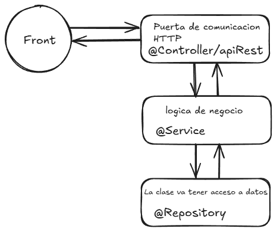
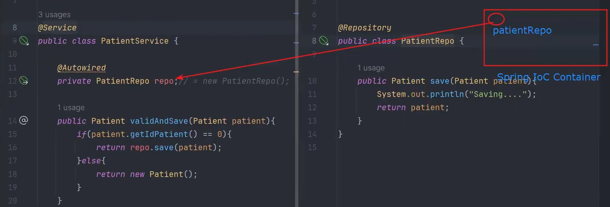
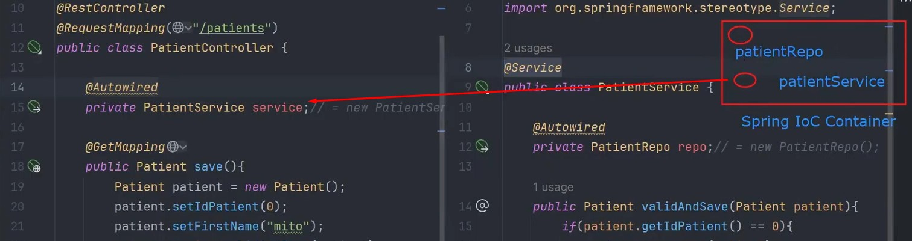
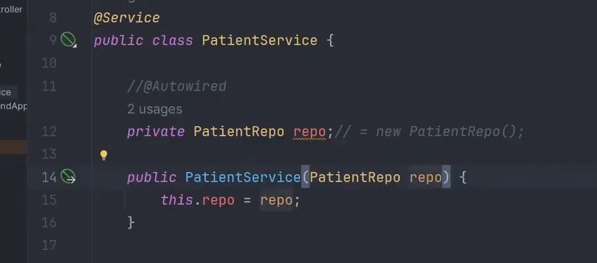
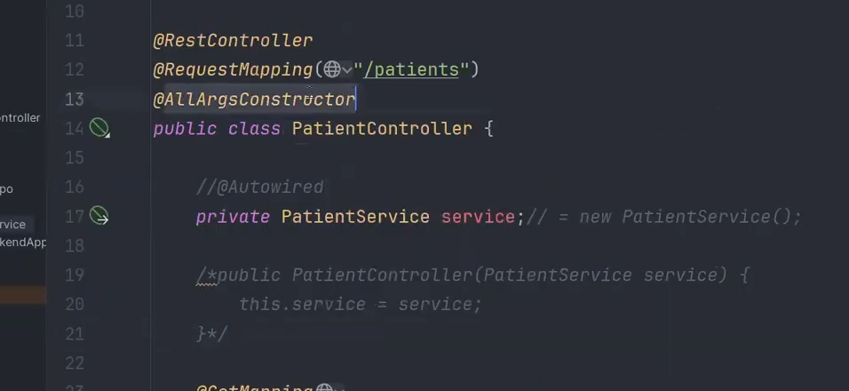
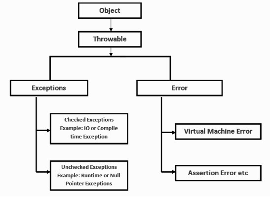

# 📜 Algo de historia

---

Spring Framework se creo para el Java Enterprise Edition.
Spring Boot nace para facilitar el uso de spring Framework.
En spring framework tenemos módulos para Data Access (JDBC, JPA, Hibernate), Web (MVC, REST), Security, Testing, AOP, Aspects, Core Container, etc.
Cuando trabajas con spring boot internamente trabajas con spring framework.
    Spring Boot 3.x = Spring Framework 6 , exige java 17 como mínimo
    Spring Boot 2.x = Spring Framework 5 , exige java 8 hasta java 21
    Spring Boot 1.x = Spring Framework 4 , exige java 6 hasta java 8

Servicios Rest comunicaran al Backend con el Frontend con usos de JSON. Esto viaja sobre el protocolo HTTP con los diferentes verbos GET, POST, PUT, DELETE.

Un enfoque monolítico en el desarrollo de software (y específicamente en proyectos Java) es una arquitectura tradicional donde toda la aplicación se construye como una única pieza unificada e indivisible.

Oracle JDK 17 no va cobrar hasta un año despues del siguiente LTS (Java 21)
LTS: Last Time Support.
Ahora cada 6 meses se lanzan un LTS

---

# Comparativa de Arquitecturas: Monolito vs. Microservicios

| Característica | Enfoque Monolítico (Monolito) | Arquitectura de Microservicios |
| :--- | :--- | :--- |
| **Estructura de Código** | Todo el sistema (UI, lógica, acceso a datos) convive en un único proyecto y base de código. | El sistema se divide en servicios pequeños, independientes y especializados por dominio de negocio. |
| **Despliegue** | Se compila y despliega como una única unidad (un solo archivo `.jar` o `.war`). | Cada servicio se compila y despliega de forma totalmente independiente (usualmente en contenedores). |
| **Escalabilidad** | Unidimensional. Para escalar un módulo pesado, debes clonar (escalar) toda la aplicación completa. | Multidimensional. Puedes escalar únicamente el servicio que está recibiendo alto tráfico. |
| **Tolerancia a Fallos** | Baja. Un error crítico en un módulo (ej. un `OutOfMemory`) puede hacer caer a toda la aplicación. | Alta. Si un servicio falla (ej. el servicio de correos), el resto del sistema sigue operando con normalidad. |
| **Stack Tecnológico** | Rígido. Toda la aplicación está atada a un único lenguaje de programación y versión de framework. | Flexible. Cada microservicio puede estar escrito en el lenguaje y base de datos que mejor resuelva su problema. |
| **Complejidad Inicial** | Baja. Es muy fácil y rápido de crear, desarrollar y probar localmente al inicio del proyecto. | Alta. Requiere infraestructura compleja desde el día uno (API Gateways, orquestadores, descubrimiento de servicios). |
| **Mantenimiento a largo plazo**| Difícil. Con el crecimiento, el código tiende a acoplarse y convertirse en "código espagueti". | Más manejable. Al estar el código aislado, los equipos pueden trabajar en paralelo sin pisarse los cambios. |
| **Pruebas (Testing)** | Las pruebas de integración son más sencillas porque no dependen de red ni servicios externos. | Las pruebas de integración son complejas debido a la comunicación por red y la asincronía entre servicios. |

---
# Inyecciones de dependencias 

## Internamente lombok realiza el get y set:

    @NoArgsConstructor: Para prescindir del constructor, es decir, que no se pueda crear una instancia de la clase.
    @AllArgsConstructor: Para prescindir del constructor con sus atributos.
    @Data: getter y setter, toString and equalsand hashcode

## Estos 4 decoradores es igual a @Data:

    @Getter
    @Setter
    @ToString
    @EqualsAndHashCode

**Nota: no confundir con los Record, que apareció en java 17. Estos sirven para generar objetos inmutables.**

    public record Person(String name, int age) { 
    }

---

# 🏥 Mediapp Backend

Este repositorio contiene el código fuente de la API RESTful para el sistema **Mediapp**. El proyecto está construido utilizando **Java** y **Spring Boot**, siguiendo una arquitectura de capas y buenas prácticas de desarrollo backend.

## 🛠 Tecnologías Utilizadas

* **Lenguaje:** Java 17 (o 21)
* **Framework:** Spring Boot 3.x
* **Base de Datos:** PostgreSQL / MySQL (Configurable)
* **Persistencia:** Spring Data JPA / Hibernate
* **Control de Versiones:** Git & GitHub
* **Construcción:** Maven
* **Documentación API:** OpenAPI (Swagger)

---

## 🚀 Arquitectura de Capas Inicial

    @RestController: Indica que la clase es un controlador de API RESTful.
    Servicio REST: pieza de software que se comunica intercambiando mensajes en el protocola HTTP.
    Se debe definir el punto de acceso o "endpoint" de la API.
        @RequestMapping > @GetMapping | @PostMapping | @PutMapping | @DeleteMapping


Spring Stereotype: categorizar o contextualizar a algo bajo un conjunto de características

    @Service: Va tener logica de negocio
    @Repository: La clase va tener acceso a datos
    @Component: Utilitarios / cuando no se puede categorizar en las otras
    @Controller: Controlador de la API / no es popular
    @RestController: Controlador de la API que devuelve JSON

---

Spring crea un instancia en memoria que son como beans de tipo Singleton (instancia compartida a lo largo de la aplicación, 
para que se comunique entre capa y capa), en service llamamos a esa instancia con @autowired, lo mismo pasa con @Service.





Si comentamos el @autowired y declaramos por constructor, seria asi (ya que el autowired esta lanzando una alerta)
    @AllArgsConstructor: Para prescindir del constructor con sus atributos, es mas limpio.
    @RequiredArgsConstructor: Quiero un constructor con campos obligatorios o requeridos. Inyección de dependencia con campos requeridos.


Y nos ahorramos codigo si usamos @AllArgsConstructor



---

Interfaces: para que el código sea más limpio y más legible.
La buena práctica es trabajar orientado a interfaces, para que el código se desacople entre capa y capa por si cambia alguna implementación no afecta las capas de arriba.
El JpaRepository tiene implementado el CRUD y sus atributos son -> <Clase, ID>

Solo una clase implementa una interface, pero puede implementar varias interfaces (implements).
```java
    public class PatientRepoImpl implements IPatientRepo {

    }
```

Entre interfaces se heredan (extends):
```java
    public interface IPatientRepo extends JpaRepository<Objeto, Key> {
    }
```

---

## 🚀 Guía de Inicio Rápido

### Prerrequisitos
Asegúrate de tener instalado:
1.  JDK 17 o superior.
2.  Maven (o usar el wrapper incluido `./mvnw`).
3.  Cliente Git.

### Instalación y Ejecución

1.  **Clonar el repositorio:**
    ```bash
    git clone [https://github.com/luizhuaman/mediapp-backend.git](https://github.com/luizhuaman/mediapp-backend.git)
    cd mediapp-backend
    ```

2.  **Configurar Base de Datos:**

    Spring boot tiene que tener su dependencia de JPA que se debe añadir en pom.xml
    ```xml
        <dependency>
            <groupId>org.springframework.boot</groupId>
            <artifactId>spring-boot-starter-data-jpa</artifactId>
        </dependency>    
    ```
    
    Abre el archivo `src/main/resources/application.properties` y configura tus credenciales:
    ```properties
    #JPQL -> SQL Oriented a objects (para checar logs, queries de las consultas.)
    spring.jpa.show-sql=true
    
    #ORM (Object Relationship Mapping) - permite manipulación de los objetos de la BD a traves de código java
    #update: solo agrega cambios (columnas adicionales), no modifica lo ya creado
    spring.jpa.hibernate.ddl-auto=update

    spring.datasource.driver-class-name=org.postgresql.Driver
    #Desde Spring Boot 3.1
    spring.jpa.database-platform=org.hibernate.dialect.PostgreSQLDialect
    #para conexión a la base de datos
    spring.datasource.url=jdbc:postgresql://localhost:5432/mediapp_db
    spring.datasource.username=tu_usuario
    spring.datasource.password=tu_password
    
    #Si colocamos ${DB_USERNAME}, entonces java va a buscar la variable de entorno DB_USERNAME en tu S.O. o en tu .env
    #otra opcion es que este configurada en el webLogic jboss o en el archivo .env o en el archivo application.properties por ultimo
    ```

    **Diccionario properties como server.port**

    `https://docs.spring.io/spring-boot/appendix/application-properties/index.html`

3. Ejemplo de un Entity para que lo lea como una tabla en la base de datos:

    integer < long - UUID (caracateres hexadecimales)
    @Column sirve para especificar los atributos de la columna en la tabla.
    @Table sirve para renombrar la tabla en la base de datos.
         @Table(name = "patient", schema = "campsys")
    Java maneja la convencion lowerCamelCase y la BD snake first_name

```java
@Entity
@Table(name = "patient")
public class Patient {
    @Id
    @GeneratedValue(strategy = GenerationType.IDENTITY)
    private Long id;
    
    //@Column sirve para especificar los atributos de la columna en la tabla.
    @Column(nullable = false, length = 70)
    private String firstName;
}
```

4. **Ejecutar la aplicación:**
    ```bash
    ./mvnw spring-boot:run
    ```

La aplicación iniciará generalmente en: `http://localhost:8080`

---

## 📚 Documentación de la API (Swagger)

Una vez iniciada la aplicación, puedes probar los endpoints y ver la documentación interactiva en:

* **Swagger UI:** `http://localhost:8080/swagger-ui.html`
* **OpenAPI JSON:** `http://localhost:8080/v3/api-docs`

---


## 📦 Comandos de Construcción (Maven)

Para generar el artefacto desplegable (`.jar`):

```bash
# Limpiar y empaquetar sin ejecutar tests (opcional)
./mvnw clean package -DskipTests
```

## 🐙 Guía de Referencia Git (Configuración del Proyecto)
Esta sección documenta cómo se configuró este repositorio y los comandos útiles para el flujo de trabajo diario.

```bash
# 1. Inicialización local
git init

# 2. Ignorar archivos innecesarios (target, .idea, etc.)
echo "target/" > .gitignore

# 3. Vinculación con GitHub
git remote add origin [https://github.com/luizhuaman/mediapp-backend.git](https://github.com/luizhuaman/mediapp-backend.git)
git branch -M master
```

## Flujo de Trabajo Diario
### 1. Subir cambios (Push):
```bash
git status              # Ver archivos modificados
git add .               # Preparar todos los archivos
git commit -m "Mensaje" # Guardar cambios localmente
git push origin master  # Enviar a GitHub
```

### 2. Descargar cambios (Pull):
```bash
git pull origin master
```

### 3. Ver historial:
```bash
git log --oneline
```


## 🧠 Arquitectura y Prácticas de Desarrollo

Este proyecto no es solo un CRUD; implementa prácticas de desarrollo moderno enfocadas en la mantenibilidad y eficiencia:

### 🔹 Java Moderno y Programación Funcional
Se aprovechan las características de **Java 17+** para escribir código declarativo, legible y robusto:
* **Streams API:** Uso extensivo de flujos para filtrar, transformar y agregar colecciones de datos de manera eficiente, evitando bucles `for` anidados complejos.
* **Lambdas & Method References:** Sintaxis concisa para implementaciones funcionales.
* **Clase Optional:** Manejo seguro de valores nulos (Null Safety) para reducir drásticamente las `NullPointerException`.

### 🔹 Ecosistema Spring Boot
* **Inyección de Dependencias:** Desacoplamiento de componentes para facilitar el testing y la modularidad.
* **Spring Data JPA:** Abstracción de la capa de persistencia optimizando consultas a base de datos.
* **Validación Declarativa:** Uso de Bean Validation (`@Valid`, `@NotNull`) para garantizar la integridad de los datos de entrada.

### 🔹 Clean Code & Boilerplate
* **Project Lombok:** Reducción de código repetitivo (Getters, Setters, Builders) para mantener las clases de dominio limpias.
* **Patrón DTO:** Separación estricta entre las Entidades de Base de Datos y los objetos de transferencia a la API.

## ⚡ Ejemplo de Código: Enfoque Funcional

El proyecto prioriza el estilo funcional para la transformación de datos. Ejemplo de cómo se procesan las listas utilizando `Stream` y `Map`:

```java
// Ejemplo: Filtrar productos activos, aplicar descuento y obtener nombres
List<String> activeProducts = repository.findAll().stream()
    .filter(Product::isActive)                           // Predicado (Filter)
    .map(product -> applyDiscount(product, 0.10))        // Transformación (Map)
    .map(Product::getName)                               // Extracción
    .collect(Collectors.toList());                       // Reducción
```

## ⚡ Ejemplo de Implementación: Lógica Financiera Segura

Este proyecto prioriza la precisión en el manejo de datos monetarios. A continuación, un ejemplo real de cómo se utiliza **Java Streams** y **BigDecimal** para analizar transacciones, evitando la pérdida de precisión de los tipos `double`:

```java
// Caso de Uso: Filtrar créditos recientes y calcular total por canal
public Map<String, BigDecimal> analyzeRecentCredits(List<Transaction> transactions) {
    LocalDateTime cutOffDate = LocalDateTime.now().minusMonths(1);

    return transactions.stream()
        .filter(t -> t.getDate().isAfter(cutOffDate))             // 1. Filtro temporal
        .filter(t -> "CREDIT".equals(t.getType())                 // 2. Filtro de negocio
                  && t.getAmount().compareTo(new BigDecimal("1000")) > 0)
        .collect(Collectors.groupingBy(                           // 3. Agrupación
            Transaction::getChannel,
            Collectors.reducing(                                  // 4. Reducción segura
                BigDecimal.ZERO,
                Transaction::getAmount,
                BigDecimal::add
            )
        ));
}
```
<details>
<summary><b>🔍 Ver implementación: Manejo Centralizado de Errores (@ControllerAdvice)</b></summary>

El proyecto implementa `ProblemDetails` (RFC 7807) para estandarizar las respuestas de error, desacoplando la lógica de negocio del manejo de excepciones HTTP.

```java
@RestControllerAdvice
public class GlobalExceptionHandler {

    @ExceptionHandler(ResourceNotFoundException.class)
    public ProblemDetail handleNotFound(ResourceNotFoundException ex) {
        return ProblemDetail.forStatusAndDetail(HttpStatus.NOT_FOUND, ex.getMessage());
    }

    @ExceptionHandler(MethodArgumentNotValidException.class)
    public ProblemDetail handleValidationErrors(MethodArgumentNotValidException ex) {
        ProblemDetail problemDetail = ProblemDetail.forStatus(HttpStatus.BAD_REQUEST);
        problemDetail.setTitle("Error de Validación");
        
        // Mapea los errores de campo a un formato legible
        Map<String, String> errors = new HashMap<>();
        ex.getBindingResult().getFieldErrors().forEach(error -> 
            errors.put(error.getField(), error.getDefaultMessage()));
            
        problemDetail.setProperty("errors", errors);
        return problemDetail;
    }
}
```
</details>

<details>
<summary><b>🔍 Ver implementación: Excepciones</b></summary>

[URL +Detalle](https://eudriscabrera.com/blog/2024/manejo-de-excepciones-en-java)

En Java tenemos dos tipos de errores. Aquellos que heredan de la clase Error y los de la clase exception y así mismo ambos heredan de la clase throwable.
Una exception no es más que un error del cual podemos volver (Ej. Division ente cero), mientras que los errores terminan con el programa (Ej. Desborde de la memoria)



Entonces dentro de las excepciones tenemos checked y unchecked exceptions.
Unchecked Exceptions: Heredan de la clase Runtime Exception y son excepciones que no necesitan ser atrapadas debido a que pueden ser prevenidas a tráves del código limpio por ejemplo comprobar que exista el indice del array (Ej. ArrayIndexOutOfBoundsException)
Checked Exceptions: Son excepciones que se detectan en tiempo de compilación por el compilador que las detecta como posible fallo y que no pueden ser prevenidas por el programador porque pueden depender de factores externos como que el usuario introduzca un numero invalido o cero (Ej. ArithmeticException).
Finalmente es una buena práctica ir de la exception más particular a la más general como se muestra a continuación:

```java
    try {
        // Code that might throw exceptions
    } catch (FileNotFoundException e) {
        // Handle specific file not found error
        System.err.println("File not found: " + e.getMessage());
    } catch (IOException e) {
        // Handle general I/O errors (parent of FileNotFoundException)
        System.err.println("I/O error: " + e.getMessage());
    } catch (Exception e) {
        // Handle any other general exception
        System.err.println("An unexpected error occurred: " + e.getMessage());
    }
```
</details>

## 👨‍💻 Sobre el Desarrollador

Este proyecto es mantenido por **Luis Huaman**, un profesional híbrido (Backend Developer & Data Engineer) apasionado por la calidad del software y la inteligencia de datos.

* **Stack Principal:** Java (Spring Boot), SQL (Oracle/Postgres), Python (PySpark).
* **Certificaciones:** Microsoft Certified: Azure Data Fundamentals (DP-900). En ruta hacia DP-600.
* **Intereses:** Inversiones bursátiles (BVL), automatización con Linux y optimización de rendimiento.
* **Filosofía de Trabajo:** Inspirado en la mejora continua (*Kaizen*) y principios de libros como *"Atomic Habits"* y *"The 5 AM Club"*.

[Visita mi LinkedIn](https://www.linkedin.com/in/luishuaman94)